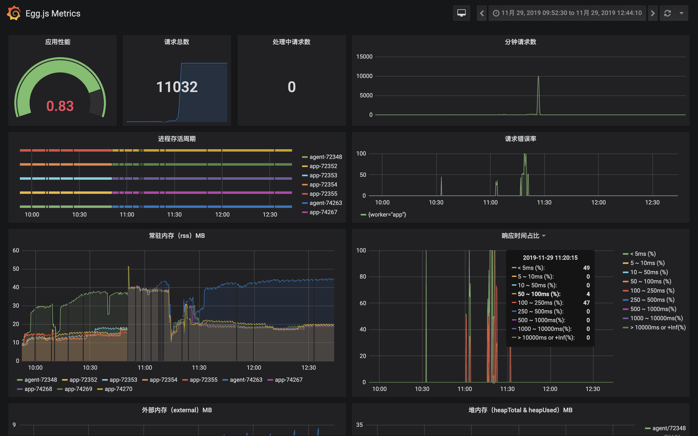

# egg-exporter

Languages: [English] [[简体中文](./README-CN.md)] 


[![NPM version][npm-image]][npm-url]
[![npm download][download-image]][download-url]

[npm-image]: https://img.shields.io/npm/v/egg-exporter.svg?style=flat-square
[npm-url]: https://npmjs.org/package/egg-exporter
[download-image]: https://img.shields.io/npm/dm/egg-exporter.svg?style=flat-square
[download-url]: https://npmjs.org/package/egg-exporter

<!--
[![build status][travis-image]][travis-url]
[![Test coverage][codecov-image]][codecov-url]
[![David deps][david-image]][david-url]
[![Known Vulnerabilities][snyk-image]][snyk-url]

[travis-image]: https://img.shields.io/travis/eggjs/egg-prometheus.svg?style=flat-square
[travis-url]: https://travis-ci.org/eggjs/egg-prometheus
[codecov-image]: https://codecov.io/gh/eggjs/egg-prometheus/branch/master/graph/badge.svg
[codecov-url]: https://codecov.io/gh/eggjs/egg-prometheus
[david-image]: https://img.shields.io/david/eggjs/egg-prometheus.svg?style=flat-square
[david-url]: https://david-dm.org/eggjs/egg-prometheus
[snyk-image]: https://snyk.io/test/npm/egg-prometheus/badge.svg?style=flat-square
[snyk-url]: https://snyk.io/test/npm/egg-prometheus
-->

This project is based on [egg-prometheus](https://github.com/eggjs/egg-prometheus), with more performance metrics. It provides more [Prometheus](https://prometheus.io) functionalities for egg. For more information, please refer to [Node.js monitering solutions](https://hahhub.com/post/2020-05-eggjs-prometheus-monitor/).


## Demonstration



## Installation

```bash
$ npm i egg-exporter --save
```

## Usages

### Start the plugin

Start the plugin with configurations in `${app_root}/config/plugin.js`:

```js
exports.exporter = {
  enable: true,
  package: 'egg-exporter',
};
```

### Configuration

```js
exports.exporter = {
  scrapePort: 3000,
  scrapePath: '/metrics',
  prefix: 'egg_',
  defaultLabels: { stage: 'dev' },
};
```

- `scrapePort`: the port used to scrape metrics
- `scrapePath`: the path used for monitoring metrics
- `prefix`: the prefix for the metrics names
- `defaultLabels`: default metrics labels, globally effective
- `aggregatorPort`: the TCP port for RPC

## Builtin Metrics

- `http_request_duration_milliseconds histogram`: http request duration
- `http_request_size_bytes summary`: http request body size
- `http_response_size_bytes summary`: http reponse body size
- `http_request_total counter`: number of http requests
- `http_all_errors_total counter`: number of http erorrs
- `http_all_request_in_processing_total gauge`: number of http requests being processed
- `process_resident_memory_bytes gauge`: resident memory size
- `nodejs_heap_size_total_bytes gauge`: allocated heap memory size
- `nodejs_heap_size_used_bytes gauge`: allocated stack memory size
- `nodejs_external_memory_bytes gauge`: C++ bind objects memory usage
- `nodejs_version_info`: version information

When the egg-rpc-base plugin is enabled, the following metrics are also provided
- `rpc_consumer_response_time_ms summary`: rpc client response time in milliseconds
- `rpc_consumer_request_rate counter`: rpc client number of requests
- `rpc_consumer_fail_response_time_ms summary`: rpc client failed response time
- `rpc_consumer_request_fail_rate counter`: rpc failed requests
- `rpc_consumer_request_size_bytes summary`: rpc request size
- `rpc_consumer_response_size_bytes summary`: rpc response size
- `rpc_provider_response_time_ms summary`: rpc server response time
- `rpc_provider_request_rate counter`: rpc server number of requests received
- `rpc_provider_fail_response_time_ms summary`: rpc server failed response time in milliseconds
- `rpc_provider_request_fail_rate counter`: rpc server failed responses

## Customized Metrics

You may use the following API to customize metrics in your business logics.
```js
const counter = new app.prometheus.Counter({
  name: 'xxx_total',
  help: 'custom counter',
  labelNames: [ 'xxx' ],
});

const gauge = new app.prometheus.Gauge({
  name: 'xxx_gauge',
  help: 'custom gauge',
  labelNames: [ 'xxx' ],
});

const histogram = new app.prometheus.Histogram({
  name: 'xxx_histogram',
  help: 'custom histogram',
  labelNames: [ 'xxx' ],
});

const summary = new app.prometheus.Summary({
  name: 'xxx_summary',
  help: 'custom summary',
  labelNames: [ 'xxx' ],
});
```

## How to contribute

Please tell us what we can do for you, but before that, check if there are existing [bugs or issues](https://github.com/NFTGo/egg-exporter/issues).

## License

[MIT](LICENSE)
